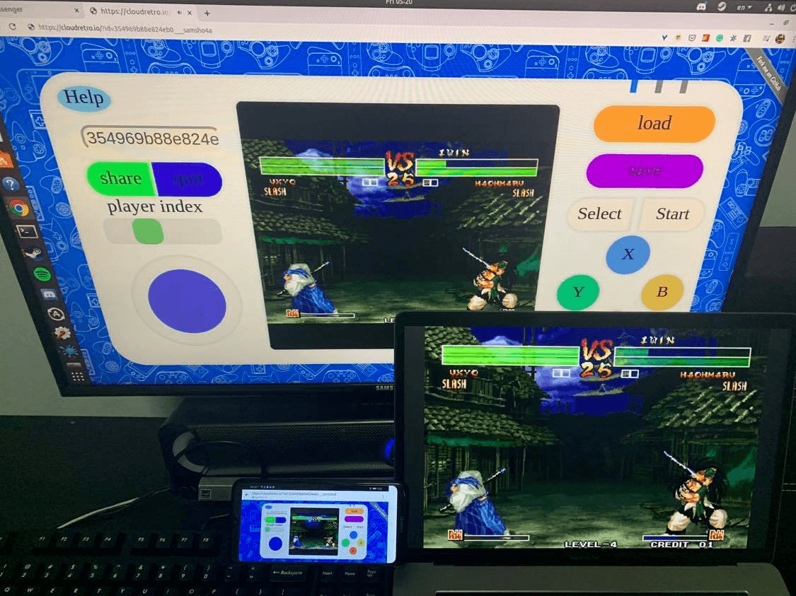

# CloudRetro

[](https://github.com/giongto35/cloud-game/actions?query=workflow:build)
[](https://github.com/giongto35/cloud-game/releases/latest)

**Open-source Cloud Gaming Service For Retro Games**  
**Video demo**: https://www.youtube.com/watch?v=GUBrJGAxZZg  
**Technical wrapup**: https://webrtchacks.com/open-source-cloud-gaming-with-webrtc/  
**CloudMorph**: [https://github.com/giongto35/cloud-morph](https://github.com/giongto35/cloud-morph): My current focus on generic solution for cloudgaming

## Introduction
CloudRetro provides an open-source cloud gaming platform for retro games. It started as an experiment for testing cloud gaming performance with [WebRTC](https://github.com/pion/webrtc/) and [libretro](https://www.libretro.com/), and now it aims to deliver the most modern and convenient gaming experience through the technology.

Theoretically, in cloud gaming, games are run on remote servers and media are streamed to the player optimally to ensure the most comfortable user interaction. It opens the ability to play any retro games on web-browser directly, which are fully compatible with multi-platform like Desktop, Android, ~~IOS~~.

## Announcement
**(Currently, I'm working on [CloudMorph](https://github.com/giongto35/cloud-morph): It offers more generic solution to run any offline games/application on browser in Cloud Gaming approach: [https://github.com/giongto35/cloud-morph](https://github.com/giongto35/cloud-morph))**

## Try the service at
Single play: **[http://cloudretro.io](http://cloudretro.io)**  
Direct play an existing game: **[Pokemon Emerald](https://cloudretro.io/?id=4a5073a4b05ad0fe___Pokemon%20-%20Emerald%20Version%20(U))**

\*In ideal network condition and less resource contention on servers, the game will run smoothly as in the video demo. Because I only hosted the platform on limited servers in US East, US West, Eu, Singapore, you may experience some latency issues + connection problem. You can try hosting the service following the instruction the next section to have a better sense of performance.

|                   Screenshot                   |                   Screenshot                   |
| :--------------------------------------------: | :--------------------------------------------: |
|  |  |
|     |  |

## Feature
1. **Cloud gaming**: Game logic and storage is hosted on cloud service. It reduces the cumbersome of game initialization. Images and audio are streamed to user in the most optimal way using advanced encoding technology.
2. **Cross-platform compatibility**: The game is run on web browser, the most universal built-in app. No console, plugin, external app or devices are needed.
3. **Emulator agnostic**: The game can be played directly without any extra effort to set up the gaming emulator or platform.
4. **Collaborate gameplay**: Follow the idea of crowdplay([TwitchPlaysPokemon](https://en.wikipedia.org/wiki/Twitch_Plays_Pok%C3%A9mon)), multiple players can play the same game together by addressing the same deeplink. The game experience is powered by cloud-gaming, so the game is much smoother. [Check CrowdPlay section](#crowd-play-play-game-together)
5. **Online multiplayer**: The first time in history, you can play multiplayer on Retro games online. You can try Samurai Showndown with 2 players for fighting game example.
5. **Horizontally scaled**: The infrastructure is designed to be able to scale under high traffic by adding more instances.
6. **Cloud storage**: Game state is storing on online storage, so you can come back and continue playing your incomplete game later.

## Development environment

Install Golang https://golang.org/doc/install . Because the project uses GoModule, so it requires Go1.11 version.

### (All) Install Dependencies

  * Install [libvpx](https://www.webmproject.org/code/), [libopus](http://opus-codec.org/), [pkg-config](https://www.freedesktop.org/wiki/Software/pkg-config/), [sdl2](https://wiki.libsdl.org/Installation)
```
# Ubuntu / Windows (WSL2)
apt-get install -y pkg-config libvpx-dev libopus-dev libopusfile-dev libsdl2-dev

# MacOS
brew install libvpx pkg-config opus opusfile sdl2

# Windows (MSYS2)
pacman -Sy --noconfirm --needed git make mingw-w64-x86_64-{gcc,pkg-config,dlfcn,libvpx,opusfile,SDL2}
```

Because the coordinator and workers need to run simultaneously. Workers connect to the coordinator.
1. Script
  * `make dev.run`
  * The scripts spawns 2 processes one in the background and one in foreground
2. Manual
  * Need to run coordinator and worker separately in two session
  * `go run cmd/coordinator/main.go` - spawn coordinator
  * `go run cmd/worker/main.go --coordinatorhost localhost:8000` - spawn workers connecting to coordinator

## Run with Docker

In case if you want to run the app as a Docker container,
use `docker-compose up --build` (`CLOUD_GAME_GAMES_PATH` is env variable for games on your host).
It will spawn a docker environment and you can access the service on `localhost:8000`.

*Note.*
Docker for Windows is not supposed to work with provided configuration, use WSL2 instead.

## Technical Document
- [webrtchacks Blog: Open Source Cloud Gaming with WebRTC](https://webrtchacks.com/open-source-cloud-gaming-with-webrtc/)
- [Wiki (outdated)](https://github.com/giongto35/cloud-game/wiki)

|              High level              |               Worker internal               |
| :----------------------------------: | :-----------------------------------------: |
|  |  |

## FAQ
- [FAQ](https://github.com/giongto35/cloud-game/wiki/FAQ)

## Crowd Play, play game together
By clicking these deep link, you can join the game directly and play it together with other people.
- [Play Pokemon Emerald](http://cloudretro.io/?id=652e45d78d2b91cd%7CPokemon%20-%20Emerald%20Version%20%28U%29)
- [Fire Emblem](http://cloudretro.io/?id=314ea4d7f9c94d25___Fire%20Emblem%20%28U%29%20%5B%21%5D)
- [Samurai Showdown 4](https://cloudretro.io/?id=733c73064c368832___samsho4)
- [Metal Slug X](https://cloudretro.io/?id=2a9c4b3f1c872d28___mslugx)

And you can host the new game by yourself by accessing [cloudretro.io](http://cloudretro.io) and click "share" button to generate a deeplink to your current game.

<p align="center">
   <br>
Synchronize a game session on multiple devices
</p>

## Contribution
We are very much thankful to everyone who contributes to the project:

- [88hcsif](https://github.com/88hcsif)
- [sadlil](https://github.com/sadlil)
- [sergystepanov](https://github.com/sergystepanov/)

## Credits

* *Pion* Webrtc team for the incredible Golang Webrtc library and their supports https://github.com/pion/webrtc/.
* *libretro/kivutar* Golang libretro https://github.com/libretro/go-nanoarch and https://www.libretro.com/.
* *gen2brain* for the h264 go encoder https://github.com/gen2brain/x264-go
* *poi5305* for the video encoding https://github.com/poi5305/go-yuv2webRTC.
* *fogleman* for the NES emulator https://github.com/fogleman/nes.

## Author

Nguyen Huu Thanh  
https://www.linkedin.com/in/huuthanhnguyen/

Tri Dang Minh  
https://trich.im

