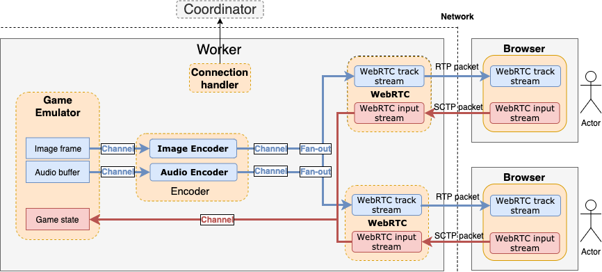
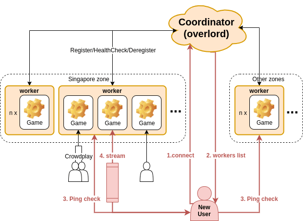

# Web-based Cloud Gaming Service Design Document

Web-based Cloud Gaming Service contains multiple workers for gaming stream and a coordinator (Coordinator) for distributing traffic and pairing up connection.

## Worker 

Worker is responsible for streaming game to frontend 

- After Coordinator matches the most appropriate server to the user, webRTC peer-to-peer handshake will be conducted. The coordinator will exchange the signature (WebRTC Session Remote Description) between two peers over Web Socket connection.  
- On worker, each user session will spawn a new room running a gaming emulator. Image stream and audio stream from emulator is captured and encoded to WebRTC streaming format. We applied Vp8 for Video compression and Opus for audio compression to ensure the smoothest experience. After finish encoded, these stream is then piped out to user and observers joining that room.  
- On the other hand, input from users is sent to workers over WebRTC DataChannel. Game logic on the emulator will be updated based on the input stream.  
- Game state is stored in cloud storage, so all workers can collaborate and keep the same understanding with each other. It allows user can continue from the saved state in the next time.  

## Coordinator

Coordinator is loadbalancer and coordinator, which is in charge of picking the most suitable workers for a user. Every time a user connects to Coordinator, it will collect all the metric from all workers, i.e free CPU resources and latency from worker to user. Coordinator will decide the best candidate based on the metric and setup peer-to-peer connection between worker and user based on WebRTC protocol

1. A user connected to Coordinator . 
2. Coordinator will find the most suitable worker to serve the user. 
3. Coordinator collects all latencies from workers to users as well as CPU usage on each machine. 
4. Coordinator setup peer-to-peer handshake between worker and user by exchanging Session Description Protocol. 
5. A game is hosted on worker and streamed to the user. 
